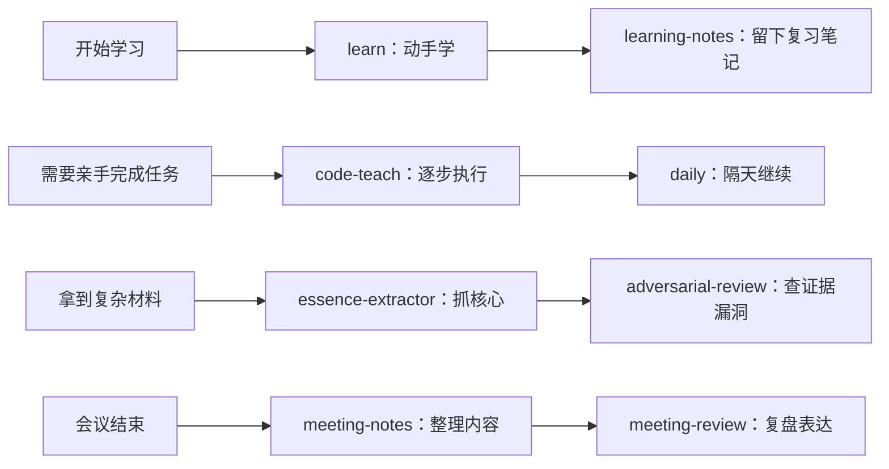

<div align="center">

# fate-workskills

<p><em>「把真正能帮你“偷懒”的工作方法，装进你的 AI」</em></p>


**一套可以直接交给 Claude、Codex 等 AI 助手的工作方法。**<br>
帮你学习、动手完成任务、整理会议、深度分析，以及在重要结论发布前主动找漏洞。

| 你要解决的问题 | 推荐组合 | 最终得到什么 |
| :--- | :---: | :--- |
| 学新东西 | `learn` + `learning-notes` | 从亲手学会，到留下能复习的笔记 |
| 跟着 AI 办事 | `code-teach` + `daily` | 一步步做完，第二天还能接着干 |
| 看懂复杂材料 | `essence-extractor` + `adversarial-review` | 抓住核心，再检查结论靠不靠谱 |
| 开会与沟通 | `meeting-notes` + `meeting-review` | 整理会议，同时提升自己的表达 |

[🚀 零基础用法](#-零基础-30-秒用法) · [🧰 八个 Skills](#-八个工具分别做什么) · [🧩 推荐组合](#-怎么组合使用) · [📦 安装](#-安装到-ai-agent) · [🔒 隐私说明](#-隐私与使用边界)

</div>

---

## 🚀 零基础 30 秒用法

**不会命令行？没装过任何工具？没关系。** 最简单的方式就是：选择一个 Skill → 复制 → 粘贴给 AI。

> Skill 可以理解成一份“给 AI 看的工作说明书”。你不需要读懂里面的技术内容，只需要复制给 AI。

### 第一步：选择你现在要解决的问题

| 我现在想…… | 点这里打开 |
| --- | --- |
| 学会一个概念，而不是只拿答案 | [`learn`](skills/learn/SKILL.md) |
| 亲手敲命令把事情做完 | [`code-teach`](skills/code-teach/SKILL.md) |
| 把刚完成的学习整理成复习笔记 | [`learning-notes`](skills/learning-notes/SKILL.md) |
| 找回昨天做到一半的任务（需要本地安装） | [`daily`](skills/daily/SKILL.md) |
| 检查论文、实验或技术结论有没有硬伤 | [`adversarial-review`](skills/adversarial-review/SKILL.md) |
| 看懂一个复杂项目真正值钱的地方 | [`essence-extractor`](skills/essence-extractor/SKILL.md) |
| 把混乱的会议转写整理成纪要和待办 | [`meeting-notes`](skills/meeting-notes/SKILL.md) |
| 复盘自己在会议里哪里说得好、哪里要改 | [`meeting-review`](skills/meeting-review/SKILL.md) |

👉 **点击上表中的蓝色 Skill 名称，就能打开对应的完整内容。**

### 第二步：复制内容

打开对应的 `SKILL.md` 后，先点击文件页面上的 **Raw（原始文件）**，再复制全文。

> **手机用户：** 长按页面 → 全选 → 复制　　**电脑用户：** `Ctrl+A` → `Ctrl+C`　　**Mac 用户：** `Command+A` → `Command+C`

### 第三步：粘贴给 AI

新建一个 Claude、Codex 或其他 AI 对话，把刚才复制的内容粘贴进去，然后直接说你的需求。例如：

```text
按这套方法教我理解 Git 分支。我是第一次学，一次只讲一步。
```

```text
按这套方法整理下面的会议转写，任何不确定的人名和数字都标成存疑。
```

就这样。除 `daily` 外，其他 skill 临时使用都不需要安装软件；`daily` 需要读取你自己电脑上的本地对话记录，因此必须安装后使用。

### 💡 不想每次重新粘贴？

可以把常用的 `SKILL.md` 放进 AI 产品的项目说明、Project instructions 或自定义指令区域。不同产品的入口名称可能不同，但原理一样：设置一次，以后在该项目中新建对话时继续沿用。

---

## 🧰 八个工具分别做什么

### 1. learn：真的学会

AI 每次只讲一个小概念，随后停下来让你亲手操作或回答检查题。你没有完成当前检查点，它不会假装你已经会了然后继续往下讲。

**适合：** 学编程、统计、AI 工具、软件配置，以及任何“我不只想要答案”的场景。

[→ 查看 learn 完整规则](skills/learn/SKILL.md)

### 2. code-teach：事情要办成，但命令由你敲

它会解释命令是什么缩写、每个参数什么意思、会改本地还是远端，以及成功后应该看到什么。一次只给一小步，你贴回结果后再继续。

**适合：** 推送 GitHub、安装环境、运行项目、修改配置。

[→ 查看 code-teach 完整规则](skills/code-teach/SKILL.md)

### 3. learning-notes：把“听懂了”变成以后能复习

它会保留你亲手做过的操作、卡点、纠正过程和复习题，同时区分哪些事情是你完成的、哪些是 AI 代劳的。

**适合：** 下课总结、学习复盘、建立个人知识库。

[→ 查看 learning-notes 完整规则](skills/learning-notes/SKILL.md)

### 4. daily：把做到一半的线索捞回来

它从本地对话记录和文件证据中恢复某一天的进展，分成“已完成 / 做到一半 / 待做”，重点告诉你下一步从哪里接上。

**适合：** 同时处理很多任务、隔天忘记做到哪里、准备每日或每周回顾。

[→ 查看 daily 完整规则](skills/daily/SKILL.md)

### 5. adversarial-review：重要结论发布前，先自己挑刺

它不负责夸，而是检查循环论证、提示泄题、样本量不足、混杂变量、代码与宣称不一致，以及数字是否能从原始记录重新算出来。

**适合：** 论文、实验报告、技术博客、产品能力说明和对外汇报。

[→ 查看 adversarial-review 完整规则](skills/adversarial-review/SKILL.md)

### 6. essence-extractor：不再被模块名和术语淹没

它会追问：“拿走哪几个机制，这个系统就会退化成更普通的东西？”然后用生活化语言、具体场景和 Mermaid 图解释真正的核心闭环。

**适合：** 看懂复杂仓库、论文、产品、商业模式和系统架构。

[→ 查看 essence-extractor 完整规则](skills/essence-extractor/SKILL.md)

### 7. meeting-notes：把会议转写变成可复核的两份文档

一份是保留完整信息的整理版，一份是三分钟总结。人名、数字、日期和承诺没有证据时不会乱猜，行动项缺负责人或截止时间时会明确写“未说明”。

**适合：** 语音备忘录、飞书/Zoom/Teams 转写、访谈和讨论记录。

[→ 查看 meeting-notes 完整规则](skills/meeting-notes/SKILL.md)

### 8. meeting-review：复盘的不是会议，是你的表达

它从你的真实发言中找证据，检查是否结论先行、结构清楚、请求明确，并为关键句提供更清晰的重说版本和下次会议准备。

**适合：** 汇报、面试、跨团队协作、客户沟通和重要讨论。

[→ 查看 meeting-review 完整规则](skills/meeting-review/SKILL.md)

---

## 🧩 怎么组合使用



最常用的四组搭配：

- **学习闭环：** `learn` → `learning-notes`
- **动手办事：** `code-teach` → `daily`
- **深度分析：** `essence-extractor` → `adversarial-review`
- **会议提升：** `meeting-notes` → `meeting-review`

这些工具不会强制捆绑。只装一个、只复制一个，也可以独立使用。

---

## ⚠️ 先读这个

- Skill 是写给 AI 的工作说明书，不是能够独立运行的手机 App。
- AI 仍然可能理解错误或遗漏证据。涉及重要决策时，请检查原始文件、数字和引用。
- `daily` 和会议类工具可能读取私人材料。使用前先确认数据范围，不要把密钥、银行卡、住址或无关隐私发给 AI。
- 默认不要覆盖原始记录和历史版本；重要产出应创建新文件或新版本。
- 本仓库不包含任何个人对话、公司材料、固定机器路径或真实凭据。

---

## 📦 安装到 AI agent

上面的“复制粘贴”适合偶尔使用。经常使用时，可以正式安装到支持 [Agent Skills](https://agentskills.io/) 的 AI agent。

### 方式一：让 agent 帮你安装

把下面这句话发给你正在使用的 Claude Code、Codex、Cursor 或其他 agent：

```text
帮我安装这个仓库里的 skills：
https://github.com/destiny520537work-lab/fate-workskills
```

### 方式二：通用 CLI

```bash
npx skills add destiny520537work-lab/fate-workskills
```

如果仓库仍是私有状态，需要先让当前电脑拥有该 GitHub 仓库的访问权限。

### 方式三：手动安装

先克隆仓库，再把 `skills/` 下需要的目录复制到对应 runtime 的 skills 目录：

| Runtime | 常见目录 |
| --- | --- |
| Claude Code | `~/.claude/skills/` |
| Codex | `~/.codex/skills/` |
| Cursor | `~/.cursor/skills/` |
| 其他 runtime | 查看该产品的 Agent Skills 文档 |

复制前先检查同名 skill，避免覆盖自己的定制版本。

---

## 📁 仓库结构

```text
fate-workskills/
├── README.md
└── skills/
    ├── adversarial-review/   # 对抗审稿
    ├── code-teach/           # 命令行陪跑
    ├── daily/                # 每日进展恢复
    ├── essence-extractor/    # 核心机制提炼
    ├── learn/                # 动手学习
    ├── learning-notes/       # 学习复盘笔记
    ├── meeting-notes/        # 会议纪要整理
    └── meeting-review/       # 会议表达复盘
```

每个目录的核心文件都是 `SKILL.md`。`agents/openai.yaml` 提供 Codex 的显示信息；[`daily` 脚本](skills/daily/scripts/extract-day.sh)用于读取本机 Claude Code 的 JSONL 对话记录，内容不会由脚本主动上传。

---

## 🔒 隐私与使用边界

- 不要提交 `.env`、API key、token、密码、私钥、对话导出或原始会议材料。
- 需要匿名化时，使用一致的角色标签，例如“负责人 A”“客户 B”。
- 使用 `daily` 前检查输出；写入长期笔记时只保留与任务接续直接有关的信息。
- 公开分享自己的改版前，重新检查 Git 历史和当前文件，而不只是搜索最新 README。

---

## 🔧 给开发者的验证方式

八个 skill 均应通过 Codex `skill-creator` 的结构校验：

```bash
for skill in skills/*; do
  python3 /path/to/skill-creator/scripts/quick_validate.py "$skill"
done
```

`daily` 依赖 `bash`、`python3`、`jq`、`perl` 和 `awk`。修改脚本后，还应使用不含隐私的临时 JSONL 测试时区边界和消息过滤。

---

给 AI 一套清楚的方法，比反复提醒“认真一点”更有用。
