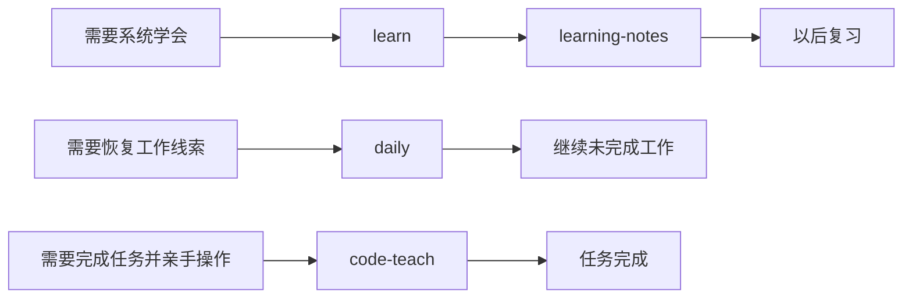

# fate-workskills

一组面向日常工作与学习的 AI agent skills：恢复每日进展、动手学习、整理学习笔记，以及陪用户亲手完成命令行任务。

> 这个仓库保存的是可复用、已脱敏的 skill。它不包含个人对话、公司信息、固定机器路径或密钥。

## 目录

- [这是什么](#这是什么)
- [四个 skill](#四个-skill)
- [它们如何配合](#它们如何配合)
- [安装](#安装)
- [怎么使用](#怎么使用)
- [目录结构](#目录结构)
- [隐私与安全](#隐私与安全)
- [验证](#验证)

## 这是什么

这些 skill 解决四类容易混在一起、但节奏不同的任务：

- 回顾某天做过什么，找到做到一半的工作；
- 以“讲一点、动手一次、检查理解”的方式学习；
- 把已经结束的学习过程整理为可复习的笔记；
- 用户坚持亲手执行时，逐词解释每条命令并等待结果。

每个 skill 都以独立的 [`SKILL.md`](skills/) 描述触发条件和执行流程。`agents/openai.yaml` 提供 Codex 的界面元数据；`daily` 还带有一个本地转录提取脚本。

## 四个 skill

| Skill | 什么时候用 | 入口 |
| --- | --- | --- |
| `daily` | 回顾昨天/某天进展，区分已完成、做到一半和待做 | [`skills/daily/SKILL.md`](skills/daily/SKILL.md) |
| `learn` | 目标是学会概念或技术，需要动手检查点 | [`skills/learn/SKILL.md`](skills/learn/SKILL.md) |
| `learning-notes` | 一次学习已经结束，需要整理成长期笔记 | [`skills/learning-notes/SKILL.md`](skills/learning-notes/SKILL.md) |
| `code-teach` | 目标是把事情办成，但用户要亲手敲命令 | [`skills/code-teach/SKILL.md`](skills/code-teach/SKILL.md) |

## 它们如何配合



`learn` 和 `code-teach` 的区别在目标：前者优先保证理解，后者优先保证任务落地。`learning-notes` 不负责上课，只复盘已经完成的学习；`daily` 则从对话和仓库证据中恢复工作状态。

## 安装

### Codex 全局安装

把需要的 skill 文件夹复制到 `~/.codex/skills/`：

```bash
cp -R skills/daily skills/learn skills/learning-notes skills/code-teach "$HOME/.codex/skills/"
```

### Claude Code 全局安装

把需要的 skill 文件夹复制到 `~/.claude/skills/`：

```bash
cp -R skills/daily skills/learn skills/learning-notes skills/code-teach "$HOME/.claude/skills/"
```

如果只想让某个项目使用，将这些目录复制到项目自己的 `.codex/skills/` 或 `.claude/skills/`。复制前先检查同名 skill，避免覆盖本地定制版本。

## 怎么使用

安装后可以直接用自然语言触发：

```text
用 daily 回顾我昨天做到哪里了。
用 learn 教我理解数据库事务，一次只讲一小段。
用 learning-notes 复盘刚刚的学习。
用 code-teach 带我亲手把仓库推到 GitHub。
```

`daily` 的脚本可单独运行：

```bash
bash skills/daily/scripts/extract-day.sh \
  2026-07-08 \
  "$HOME/.claude/projects" \
  Asia/Shanghai
```

三个参数依次是本地日期、Claude Code 转录根目录和 [IANA 时区](https://en.wikipedia.org/wiki/List_of_tz_database_time_zones)。脚本读取本地 JSONL，不上传内容；依赖 `bash`、`python3`、`jq`、`perl` 和 `awk`。

## 目录结构

```text
fate-workskills/
├── README.md
└── skills/
    ├── code-teach/
    │   ├── SKILL.md
    │   └── agents/openai.yaml
    ├── daily/
    │   ├── SKILL.md
    │   ├── agents/openai.yaml
    │   └── scripts/extract-day.sh
    ├── learn/
    │   ├── SKILL.md
    │   └── agents/openai.yaml
    └── learning-notes/
        ├── SKILL.md
        └── agents/openai.yaml
```

## 隐私与安全

- 不要把对话导出、公司材料、住址、付款信息或其他私人文件提交到本仓库。
- 所有密钥、token、密码和私钥都必须使用占位符；不要提交 `.env`。
- `daily` 会读取本地对话记录。使用前检查输出，长期笔记只保留与任务接续有关的内容。
- 公开 fork 或分享之前，再运行一次敏感信息扫描并检查 `git diff --cached`。

## 验证

四个目录都应通过 Codex `skill-creator` 提供的 `quick_validate.py`：

```bash
python3 /path/to/skill-creator/scripts/quick_validate.py skills/daily
python3 /path/to/skill-creator/scripts/quick_validate.py skills/learn
python3 /path/to/skill-creator/scripts/quick_validate.py skills/learning-notes
python3 /path/to/skill-creator/scripts/quick_validate.py skills/code-teach
```

`daily` 脚本还应使用不含隐私的临时 JSONL 样例进行测试，确认时区边界和消息过滤符合预期。
