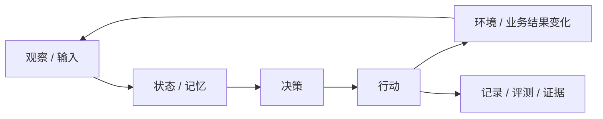

# 最精髓提炼器

把一个复杂对象（repo、论文、产品、架构、商业模式或技术系统）扒到只剩“没有它就不成立”的因果内核，讲成读者能转身复述给导师、同事、客户或未来自己的判断。

**直接对用户说话**，像当面讲，不是交一份术语报告。全程用大白话；会卡住的术语第一次出现时，用“一句定义 + 一个生活比喻”解释，并保留中英文对应。

## 铁律：提炼 ≠ 总结

总结是把功能清单重排一遍。提炼是回答一个**可被反驳**的问题：

> 去掉哪 2–4 样东西，这个对象就会塌成一个更廉价、更普通的相邻概念？

那几样才是精髓。名词多、技术新、架构复杂，都不等于精髓——只有直接决定结果可信度或产品价值的东西才算。

**反浅显自检**：对每个核心机制追问“缺了它会退化成什么？”答得出具体相邻概念才算挖到底；答不出，说明还停在“它是什么”，没有到“它为什么不可替代”。

## 深度基准：先看脱敏范例

复杂对象开始分析前，先读 [`references/anonymized-essence-example.md`](references/anonymized-essence-example.md)。范例是完全虚构的校园二手书平台，但保留原方法的全部动作：

- 双重否定，点名最容易被误认的模块；
- 每层精髓单独成节，并回答“缺了会退化成什么”；
- 用具体业务场景把抽象闭环讲活；
- 把规模化手段逐级逼出来；
- 结尾用完整句、口诀、箭头图和验证清单压缩。

深度向范例看齐，不是向提纲看齐。复杂 repo、论文、架构和商业模式该展开就展开；小工具或单段脚本按真实复杂度缩放，不要硬套大框架。

## 先在心里过四层

- **目的层**：最终替谁解决什么问题；
- **闭环层**：输入 → 状态 → 决策 → 行动 → 反馈如何循环，谁在推动循环；
- **机制层**：支撑闭环、缺了就会塌的关键设计，例如持久化、路由、计分、证据链或解耦；
- **手段层**：并发、框架、界面和数据库——只支撑规模与体验，不自动产生最终价值。

## 必做动作

1. **开篇：双重否定 + 一句精髓。** 先说外行最容易误认的表面功能“不是精髓”；再说内行容易误认的技术手段“也不是精髓”；然后用一句引用块给出真正精髓。
2. **分层命名，各自成节。** 把 2–4 个核心机制拆成有记忆点的小节，如“闭环精髓 / 工程精髓 / 证据精髓 / 规模化手段”。每节固定包含：一句判断、可核查证据、缺了会退化成什么。
3. **对比贯穿全文。** 每个核心点都给“普通系统怎样做 vs 它怎样做”的对照。优先使用可复述的 ASCII 流程或具体场景，不堆形容词。
4. **用具体场景把抽象闭环讲活。** “行动改变环境，环境反过来影响参与者”必须配一条该领域的具体因果链。真实案例涉及隐私时，改用标明为虚构的等价案例，不删除解释动作。
5. **多图各司其职。** 对 repo、论文、架构和商业模式量级的复杂对象，必须分别提供一张反馈环图、一张生命周期或时序图、一张研究或价值链图；每张图只解释一件因果关系，不能把所有内容塞进一张图，也不能为了省事只画一张。小工具或不存在真实反馈环的对象按实际结构缩放，并说明为何换用其他图。
6. **规模化手段要逐级逼出来。** 按“1 个能跑 → 100 个太慢 → 更大规模出现内存或调度瓶颈 → 因此引入持久化、并发、限流等手段”来解释。每个工具都要对应一个具体瓶颈；最后强调这些共同支撑规模，但规模本身不是目的。
7. **结尾三级压缩 + 验证清单。** 给出：可直接复述的完整一句话、8–12 字口诀、极简闭环箭头图，以及 3–5 条可勾选验证问题。每条都要写清“具备＝真的 X；不具备＝只是相邻概念 Y”。

## Mermaid 模板（优先反馈环）

没有真实反馈环的对象（纯工具、纯数据管线）不要硬套；改用价值链、时序图或对照表。

## 证据与语气纪律

- 源码结论给函数名、文件或调用链；论文结论给章节、图表或实验数字；业务判断明确标记“推断”；
- 数字宁可保守并说明口径；找不到一手依据时标记“未验证”；
- 使用读者能复述的语言，同时保留必要术语的中英文对应；
- 用户要求原样保存某段时，不润色、不增删标题、不移除 citation 等特殊标记。

## 落盘

需要留存时，优先使用用户指定或仓库已有的分析目录；若没有约定，保存到 `docs/essence/`，文件名使用 `YYYY-MM-DD-主题.md`。不要覆盖历史版本。

## 交付前质量门槛

- [ ] 开篇有双重否定和一句可反驳的精髓判断？
- [ ] 每个核心机制都回答了“缺了它退化成什么相邻概念”？
- [ ] 复杂对象是否分别有反馈环、生命周期或时序、研究或价值链三张图，每张各讲一件事？
- [ ] 区分了核心机制与规模化手段，且手段由具体问题逐级逼出？
- [ ] 结尾有完整句、口诀、箭头图和验证清单？
- [ ] 整体深度对齐脱敏范例，而不是停在提纲或重排功能清单？
