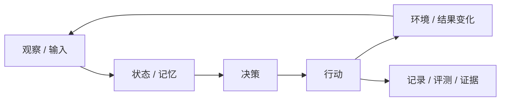

# 最精髓提炼器

把复杂对象拆到只剩“没有它就不成立”的因果内核，让没有专业背景的读者也能理解并复述。

## 铁律：提炼不等于总结

不要重排功能清单。回答这个可被反驳的问题：

> 去掉哪 2–4 样东西，这个对象会退化成一个更简单、更廉价的相邻概念？

能具体说出“缺了它会退化成什么”，才算找到精髓；否则仍停留在表面描述。

## 四层定位

- **目的层**：最终替谁解决什么问题。
- **闭环层**：输入、状态、决策、行动和反馈如何循环，谁在推动循环。
- **机制层**：让闭环可信的关键设计，例如持久化、路由、计分、证据链或解耦。
- **手段层**：并发、框架、界面和数据库等支撑规模或体验的工具。

## 必做动作

1. **双重否定开场**：先指出外行最容易误认的表面功能，再指出内行容易误认的技术手段；随后用一句引用块给出真正精髓。
2. **拆出 2–4 个核心机制**：每个机制单独成节，包含一句判断、可检查的证据，以及“缺了它退化成什么”。
3. **贯穿对比**：持续比较“普通系统怎样做”和“这个对象怎样做”，避免堆形容词。
4. **给具体场景**：用一条真实或明确标注为假设的因果链，把抽象闭环讲活。
5. **按需要画图**：复杂系统优先使用反馈环、生命周期/时序图和价值链图；每张图只解释一个关系。
6. **解释规模化手段为什么出现**：按“规模增加 → 出现瓶颈 → 引入手段”的顺序讲，而不是罗列技术名词。
7. **结尾三级压缩**：给出可复述的完整一句话、8–12 字口诀和极简箭头闭环，再附 3–5 条验证问题。

## Mermaid 模板

没有真实反馈环的对象不要硬套；改用价值链、时序图或对照表。

## 证据与表达

- 源码结论给文件、符号或调用链；论文结论给章节、图表或实验数字；业务判断标记“推断”。
- 数字宁可保守并说明口径；找不到一手依据时标记“未验证”。
- 首次出现的术语用“一句定义 + 一个生活比喻”解释，并保留中英文对应。
- 用户要求原样保存时，不润色、不改标点、不移除特殊标记。

## 落盘

需要保存时，优先使用用户指定或仓库已有的分析目录；若没有约定，建议保存到 `docs/essence/`，文件名使用 `YYYY-MM-DD-主题.md`。

## 交付前检查

- [ ] 开篇是否有双重否定和一句可反驳的精髓判断？
- [ ] 每个核心机制是否回答“缺了它退化成什么”？
- [ ] 抽象机制是否有具体场景和适当图示？
- [ ] 是否区分核心机制与规模化手段？
- [ ] 是否有完整句、口诀、箭头图和验证清单？
- [ ] 是否明确标记推断、未验证信息和证据边界？
