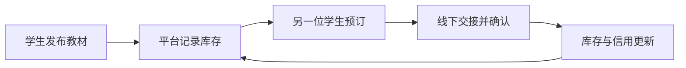
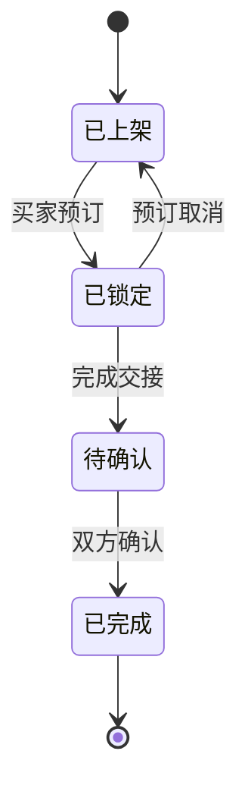
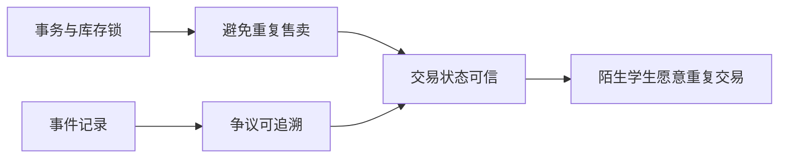

# 最精髓提炼脱敏范例

> 本范例中的产品、角色、流程和数据均为虚构，仅用于演示分析深度。

## 对象：校园二手书流转平台“纸飞机”

这套平台最精髓的部分，**不是搜索框和商品页面**；那只是用户看得见的外壳。也**不是它用了什么数据库或前端框架**；那些只是把系统撑起来的工程手段。

> 真正的精髓，是让“需求、实物状态和信任证据”形成同一个可追踪闭环，使陌生人之间的一次交易能够反复发生。

## 1. 闭环精髓：一次成交会改变下一次匹配

普通信息板只负责发布：有人贴一条卖书消息，之后发生什么，系统不知道。

“纸飞机”则记录：上架 → 被预订 → 线下交接 → 买家确认 → 库存消失 → 卖家信用更新。一次行动会改变下一位用户看到的库存和可信度。



**缺了它会退化成什么？** 退化成一个贴满过期消息的校园公告板。

## 生命周期图：一本书从出现到退出库存



这张图只回答“状态如何变化”，不重复解释反馈环。它能暴露两个关键问题：锁定期间是否还会被重复卖出，以及只有一方确认时订单停在哪里。

## 2. 证据精髓：信任不是一句“我靠谱”

平台不直接把用户自述当信用，而是保留订单状态、双方确认和争议记录。信用结果来自可回看的事件链，而不是昵称旁边随手放一个星级。

```text
普通做法：卖家说“已交付” → 系统相信
这里的做法：卖家确认 + 买家确认 + 订单状态一致 → 计入完成记录
```

**缺了它会退化成什么？** 退化成一个陌生人可以自行刷信誉的展示页。

## 3. 具体场景：一本教材如何让闭环转起来

一名学生上架一本教材 → 两人同时想买 → 第一人预订后库存锁定 → 交接完成后库存归零 → 若买家确认版本与描述一致，卖家的完成记录增加 → 下次同类教材出现时，系统优先展示描述准确且履约稳定的卖家。

这条链让“行动改变平台状态，平台状态再影响下一次行动”不再只是抽象口号。

## 4. 规模化手段：工具是被瓶颈逼出来的

1 个宿舍交易时，群聊加表格就够；覆盖 100 人时会出现重复预订，所以需要库存状态；覆盖多所学校时，列表扫描变慢，所以需要索引；高峰期大量预订同时发生时，需要事务或队列避免超卖；争议增加后，又需要可追踪的事件记录。

数据库、索引、队列和审计记录都很重要，但它们共同支撑的是“闭环在更大规模下仍然成立”，不是产品价值本身。

## 价值链图：工程手段怎样抵达用户价值



这张图只回答“底层机制为什么最终有价值”。如果只能从技术名词连到另一个技术名词，却连不到用户行为或结果，就还没有提炼到价值层。

## 三级压缩

**完整一句话：** 这是一个用库存状态和履约证据，把陌生学生之间的二手书交易变成可重复信任闭环的平台。

**口诀：** 状态流转，证据生信任。

```text
发布 → 预订 → 交接 → 确认 → 状态与信用更新 → 下一次匹配
```

## 验证清单

- [ ] 交易发生后库存会真实变化；具备＝真的交易闭环，不具备＝只是信息展示板。
- [ ] 信用来自可核查事件；具备＝真的证据信任，不具备＝只是用户自评。
- [ ] 争议能追溯到双方动作；具备＝真的可复核协作，不具备＝只是聊天撮合。
- [ ] 并发预订不会卖出同一本书两次；具备＝闭环能承受规模，不具备＝规模一大状态就失真。
