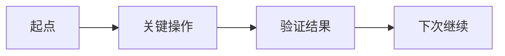

# 学习笔记复盘

把一次学习从聊天中的短期体验变成用户将来能读懂、能自测、能继续的长期笔记。**这个 skill 不自动触发**：只有用户主动要求复盘时才使用；它独立于 `learn`，不负责上课、出题或制定学习计划。

## 取材边界

1. 优先读取当前对话；用户点名的本地文档、终端输出、代码 diff 是补充证据。
2. 若存在当天的本地记忆摘要，可用作查漏，但摘要不是一手证据：不得把无法从对话或文件确认的说法写成事实。
3. 写清“用户亲手做了什么”和“AI 代为完成了什么”。不要把 AI 的动作伪装成用户已经掌握。
4. 绝不收录密钥、隐私、完整 token 或无关的原始聊天流水账；命令中的敏感值改为 `***`。
5. 用户要求保留 prompt 原文时，从当前对话或原始 transcript 提取，不凭摘要重写；错字、大小写、空格和标点都不修正，并明确标记“原文”。
6. 学习由题目或面试场景触发时，完整原题必须放在原始回答之前；不能只记录答案而遗漏问题条件。
7. 当前上下文无法确定主题、产出位置或关键事实时，先问一个最小问题；其他情形直接成文。

## 工作流

1. **还原事实**：列出学习目标、完整原题、用户的原始回答、已验证的操作、命令输出、犯过的错误、最后状态和还没学会的地方。事实与解释分开，不靠记忆补细节。
2. **确定文件**：优先使用用户指定或仓库已有的学习记录目录；若没有约定，建议 `learning/notes/`。沿用目录现有编号规则；没有编号规则时使用 `YYYY-MM-DD-主题-学习复盘.md`。
3. **按报告方式成文**：用下面的固定骨架。首段和每节首句先给结论，让用户只扫标题、首句和图也能复原这节课。
4. **做复习设计**：把抽象概念落到本次真实操作，至少给 3 道由浅入深的自测题；答案不写在题目旁边。
5. **自检后交付**：确认原题在原答之前、要求逐字保留的 prompt 已和原始来源核对、事实无臆造、Markdown 链接可用、包含 1 个 Mermaid 图、文件名/编号正确。除非用户明确要求，不替用户执行 `git add`、`commit` 或 `push`；提醒用户用已学流程自行提交。

## 笔记骨架

```markdown
# {主题}学习复盘

学习日期：YYYY-MM-DD

## 先把这次学习说清楚
这次要解决什么；开始时为什么不会；最终走到了哪里。

## 结论
用 2-4 段写最重要的理解、已验证结果、还未掌握的边界。

## 这次是怎么走通的
只保留关键转折，不复述全部聊天；每一步写“看到什么 -> 怎么判断 -> 做了什么”。



## 我亲手做过的操作
每条命令保留原文，并解释中文意思、参数、是否改变本地或远端、成功时应看到什么。

## 卡点、误解和纠正
按“当时怎么想 -> 为什么不对 -> 现在怎样判断”记录，优先写未来最可能重犯的点。

## 复习卡
3-5 道由概念到动手的问题，不直接附答案。

## 下次从哪里继续
给一个最小、能亲手完成的下一步。

## 本次评分
满分 10 分；写分数、扣分点和下次提分动作。

Sources:
- 当前对话 / 相关本地文档链接
```

## 写法标准

- 像一份严谨的复盘报告：问题说清楚、结论先行、证据链能检查、术语第一次出现就解释。
- 正文以短段落为主；列表只用于命令、卡点、复习题和明确的行动项。不要堆满模板式 bullet。
- Mermaid 画“从不会到会”的真实路径，不能只画装饰性框图。学习很小也至少有 1 张图。
- 命令解释必须具体。例：`git push origin main` 要说明 `push` 是上传本机提交、`origin` 是远端别名、`main` 是分支；它会改 GitHub 远端，成功时会看到 `main -> main`。
- 命令验收只写已经出现或确实会出现的信号；例如 `git diff --cached --check` 无输出只代表没有常见空白格式错误，不代表内容必然正确。
- 不把“会执行一次”写成“已经掌握”。保留尚需复习的部分，评分要诚实。

## 与其他 skill 的分工

- `learn`：正在教学、让用户动手、检查理解，之后可以用本笔记复习。
- `daily`：回溯某天做过什么，写工作进展。
- `research`：调研外部事实、给来源和业务判断。
- `learning-notes`：一次已完成学习的个人复盘和可回看笔记。
